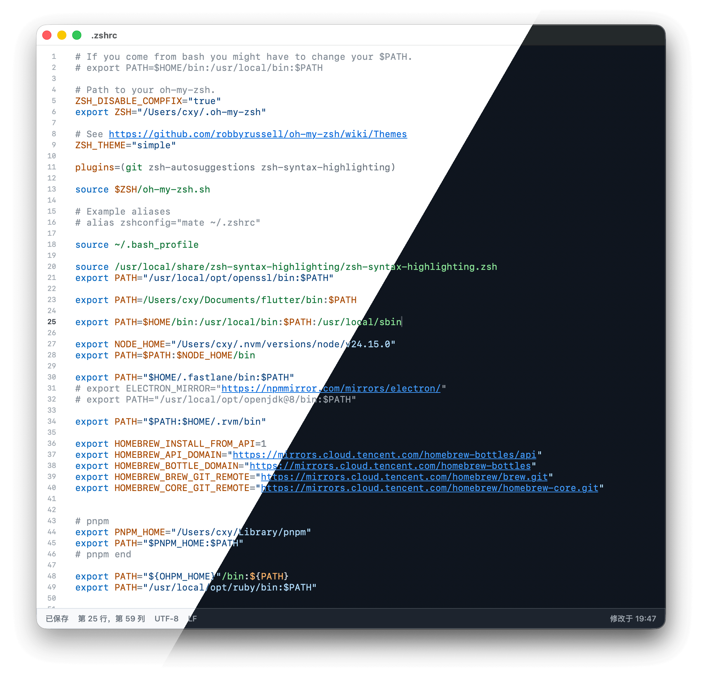

# zshrc

[](https://github.com/iHongRen/zshrc/releases) [](https://github.com/iHongRen/zshrc/releases)  [](./LICENSE)

[English README](./README.en.md)

[zshrc](https://github.com/iHongRen/zshrc) 一个极简 macOS App，打开就能查看、编辑 `~/.zshrc`，保存时自动进行语法检查。



### 安装

1、推荐使用安装脚本：

```sh
curl -fsSL https://raw.githubusercontent.com/iHongRen/zshrc/main/install.sh | sh
```

默认会安装到 `/Applications/zshrc.app`。


2、手动安装：

从 [GitHub Releases](https://github.com/iHongRen/zshrc/releases) 下载最新的 `zshrc.dmg` 后安装。终端执行命令，去除未签名应用的隔离属性：

```sh
xattr -dr com.apple.quarantine /Applications/zshrc.app
```


### 功能特性

- 直接编辑 `~/.zshrc`
- 行号显示与 Shell 语法高亮
- 搜索栏、结果计数、上一个/下一个匹配跳转
- 保存时执行语法检查
- 显示保存状态、语法状态、光标行列号
- 支持放大、缩小、恢复默认字号
- 支持浅色 / 深色 / 跟随系统
- 支持英文 / 简体中文界面
- 可以在 Finder 中定位 `.zshrc`
